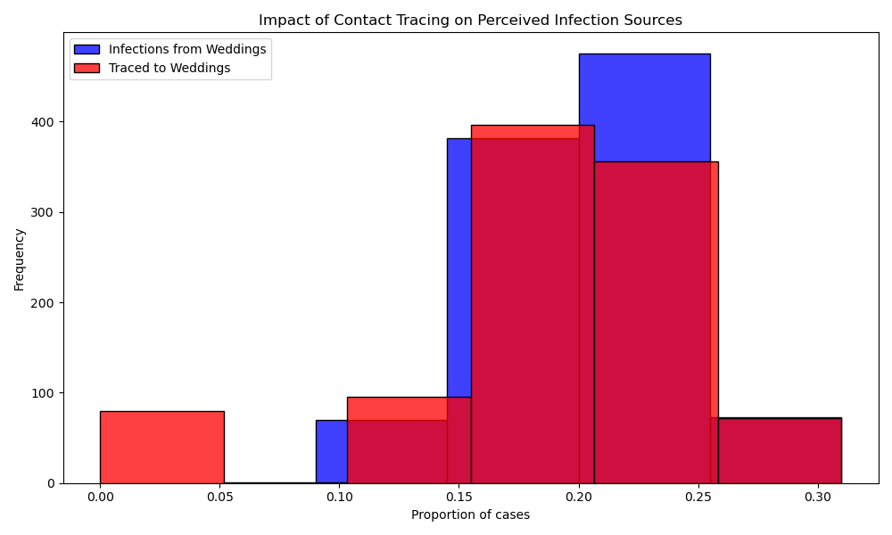
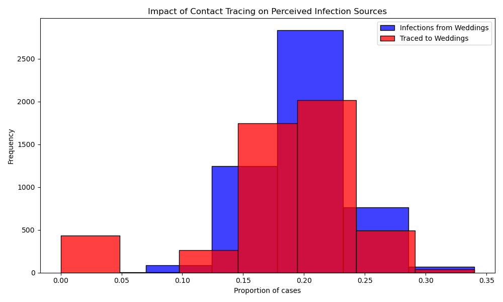

# ASSIGNMENT: Sampling and Reproducibility in Python

Read the blog post [Contact tracing can give a biased sample of COVID-19 cases](https://andrewwhitby.com/2020/11/24/contact-tracing-biased/) by Andrew Whitby to understand the context and motivation behind the simulation model we will be examining.

Examine the code in `whitby_covid_tracing.py`. Identify all stages at which sampling is occurring in the model. Describe in words the sampling procedure, referencing the functions used, sample size, sampling frame, any underlying distributions involved, and how these relate to the procedure outlined in the blog post.

Run the Python script file called whitby_covid_tracing.py as is and compare the results to the graphs in the original blog post. Does this code appear to reproduce the graphs from the original blog post?

Modify the number of repetitions in the simulation to 1000 (from the original 50000). Run the script multiple times and observe the outputted graphs. Comment on the reproducibility of the results.

Alter the code so that it is reproducible. Describe the changes you made to the code and how they affected the reproducibility of the script file. The output does not need to match Whitby’s original blogpost/graphs, it just needs to produce the same output when run multiple times

# Author: Yevhen Horokhovskykh

```
The article discusses how contact tracing can result in a biased sample of COVID-19 cases. The primary argument is that certain settings are easier to trace (like weddings) compared to others (like brunches), which can lead to an overestimation of infections from easily traceable events.

In the simulation model, individuals attending weddings and brunches are created, with 200 going to weddings and 800 to brunches. About 10% of these attendees are randomly infected. Of the infected individuals, 20% are randomly traced through primary contact tracing. Secondary contact tracing occurs for events with at least two traced infections, leading to tracing all infected attendees at those events. This multi-stage sampling defined by the `simulate_event` function reflects infection and tracing probabilities, illustrating how contact tracing can lead to a biased sample of COVID-19 cases.

As already mentioned, the population of 1000 people created by the model forms the sampling frame. Next, 10% of these individuals are randomly infected, following a uniform distribution, simulating random infection spread. Of the infected individuals, 20% are randomly traced using a Bernoulli distribution, reflecting the likelihood of successful contact tracing. Secondary contact tracing occurs deterministically when events have at least two traced infections, leading to the tracing of all infected individuals at those events. This mirrors the blog's discussion on how contact tracing can bias the perceived source of infections due to the varying traceability of different event types.

When we increase the number of repetitions from 1000 to 5000, the results become more stable and accurate. With more data points, the random variations average out, creating a clearer picture of the true underlying pattern. The second graph, with 5000 repetitions, is less bumpy and more reliable than the first one.

```





## Criteria

|Criteria|Complete|Incomplete|
|--------|----|----|
|Altercation of the code|The code changes made, made it reproducible.|The code is still not reproducible.|
|Description of changes|The author explained the reasonings for the changes made well.|The author did not explain the reasonings for the changes made well.|

## Submission Information

🚨 **Please review our [Assignment Submission Guide](https://github.com/UofT-DSI/onboarding/blob/main/onboarding_documents/submissions.md)** 🚨 for detailed instructions on how to format, branch, and submit your work. Following these guidelines is crucial for your submissions to be evaluated correctly.

### Submission Parameters:
* Submission Due Date: `HH:MM AM/PM - DD/MM/YYYY`
* The branch name for your repo should be: `sampling-and-reproducibility`
* What to submit for this assignment:
    * This markdown file (sampling_and_reproducibility.md) should be populated.
    * The `whitby_covid_tracing.py` should be changed.
* What the pull request link should look like for this assignment: `https://github.com/<your_github_username>/sampling/pull/<pr_id>`
    * Open a private window in your browser. Copy and paste the link to your pull request into the address bar. Make sure you can see your pull request properly. This helps the technical facilitator and learning support staff review your submission easily.

Checklist:
- [X] Create a branch called `sampling-and-reproducibility`.
- [X] Ensure that the repository is public.
- [X] Review [the PR description guidelines](https://github.com/UofT-DSI/onboarding/blob/main/onboarding_documents/submissions.md#guidelines-for-pull-request-descriptions) and adhere to them.
- [X] Verify that the link is accessible in a private browser window.

If you encounter any difficulties or have questions, please don't hesitate to reach out to our team via our Slack at `#cohort-3-help`. Our Technical Facilitators and Learning Support staff are here to help you navigate any challenges.
